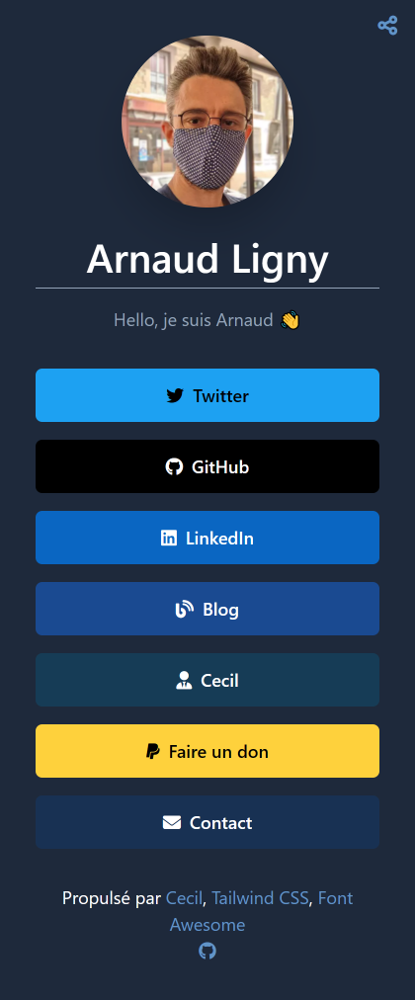

**_Links_** is a [Linktree](https://linktr.ee) clone powered by [Cecil](https://cecil.app), [Tailwind CSS](https://tailwindcss.com) and [Font Awesome](https://fontawesome.com).

[](https://cecil-links.netlify.app)

## Install

```bash
# download Cecil
curl -LO https://cecil.app/cecil.phar
```

If you need to personalize colors of the theme, you must install `tailwindcss` package with npm:

```bash
npm install
```

If you want to use the utility themes (i.e.: _[serviceworker](https://github.com/Cecilapp/theme-serviceworker#readme)_ and _[netlity](https://github.com/Cecilapp/theme-netlify#readme)_), you must run the followinf command, then enable them in your config.):

```bash
composer install
```

## Usage

### Manage links

Edit `content/index.md` to add links in _front matter_ and short presentation in _body_.

```yaml
- title: Twitter # links title
  url: https://twitter.com/ArnaudLigny/ # URL
  color: '#1DA1F2' # hexadecimal color code
  icon: brands:twitter # Font Awesome icon (https://fontawesome.com/icons): <brands|solid>:icon
```

### Configuration

Define your site's configuration in `config.yml`.

Cecil's documentation is available on [cecil.app](https://cecil.app/documentation/configuration/).

### Build and serve

```bash
# build CSS
npx tailwindcss -i ./assets/tailwind.css -o ./assets/styles.css --watch
# build and serve static website
php cecil.phar serve -v --clear-cache
```

### Publish

```bash
# build
php cecil.phar build
```

Then deploy __site_ directory content to your web hosting solution.
