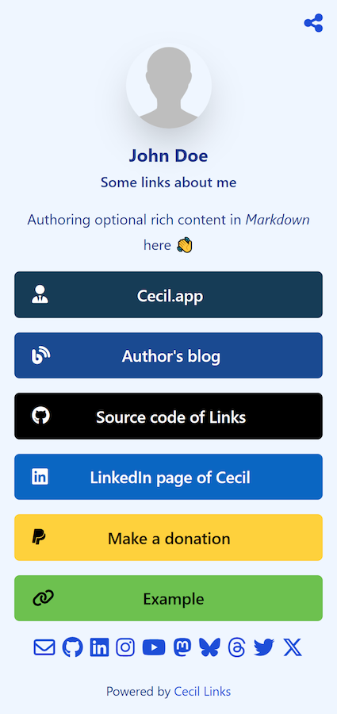

_Links_ is a Linktree alternative powered by [Cecil](https://cecil.app), [Tailwind CSS](https://tailwindcss.com) and [Font Awesome](https://fontawesome.com).

[](https://links.cecil.app)

Demo: <https://cecil-links-demo.netlify.app>

## Install

> [!IMPORTANT]
> PHP 8.1 and [Composer](https://getcomposer.org) are required.

The easiest way to create a new Links project is using Composer:

```bash
composer create-project cecil/links --ask
```

## Usage

### Preview

You can easily preview your site locally with the following command:

```bash
php cecil.phar serve --open
```

> [!TIP]
> The option `--open` automatically open your site in the default web browser.

### Configuration

Define site configuration and social identities in [`cecil.yml`](cecil.yml):

```yaml
title: <main title>
baseurl: <site URL, with a final backslash>
baseline: "<short presentation>" # optional, recommended
description: "<SEO description>" # optional, recommended
author: # used by metatags, optional
  name: <author name>
  url: <url>
  email: <email> # used in social identities block, optional
social: # social identities
  <name>: # github, linkedin, instagram, youtube, mastodon, bluesky, threads, twitter or x
    url: <url>
avatar: avatar.png
image: avatar.png # Open Graph image, optional, recommended
```

> [!TIP]
> The exhaustive [Cecil](https://cecil/app) documentation is available at [cecil.app](https://cecil.app/documentation/configuration/).

### Manage page

From `pages/index.md` file you can:

1. add links in _front matter_
2. change page structure with _blocks_ array in _front matter_
3. add rich content authoring in Markdown in page _body_ (optional)

```yaml
---
links:
  - title: <title>
    url: <url>
    color: "<#hexa_code>" # hexadecimal color code, optional (e.g. "#1DA1F2")
    icon: <style>:<name> # Font Awesome icon (https://fontawesome.com/icons), optional (e.g. "brands:github")
---
Content here.
```

## Publish

Run the following command:

```bash
php cecil.phar build
```

Then just deploy the content of __site_ directory to your web hosting solution.

## Customize color

### Theme

You can change the [theme color](ttps://tailwindcss.com/docs/customizing-colors) through the file `tailwind.config.js`, then rebuild CSS:

```bash
npm install -D tailwindcss
npx tailwindcss -i ./themes/links/tailwind.css -o ./assets/styles.css
```

## Update

If you want to update _component themes_ (i.e.: _[links](https://github.com/Cecilapp/theme-links#readme)_, _[fontawesome](https://github.com/Cecilapp/theme-fontawesome#readme)_, _[pwa](https://github.com/Cecilapp/theme-pwa#readme)_ and _[netlity](https://github.com/Cecilapp/theme-netlify#readme)_) you must run the following command:

```bash
composer update
```

## License

_Links_ is a free software distributed under the terms of the MIT license.

© [Arnaud Ligny](https://arnaudligny.fr)
